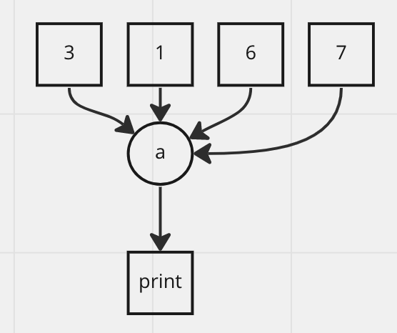
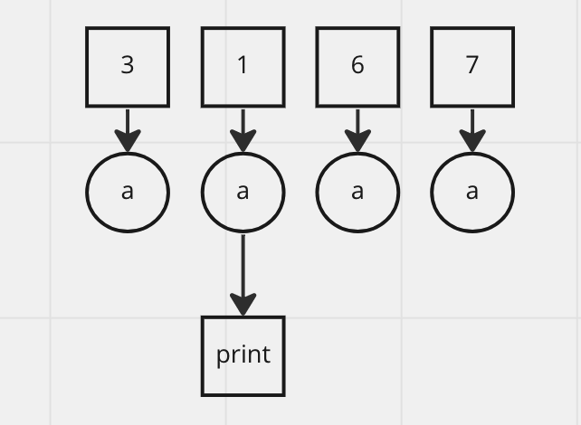

# Go Local #2

Concurrency

---

## Concurrency != Parallelism

Concurrency vs. parallelism
Concurrency is about dealing with lots of things at once.

Parallelism is about doing lots of things at once.

Not the same, but related.

Concurrency is about structure, parallelism is about execution.

Concurrency provides a way to structure a solution to solve a problem that may (but not necessarily) be parallelizable

---

## Hard to write test for them

---

## Keywords

Data Race
Atomic
Deadlock

---

## Data Race

---

## Atomic

atomic make it atomic but not guarantee sequential

---

## Deadlock

---

## Concurrency is not the god solution

sequential process -> take a long time
add go -> too much error
limited goroutine -> better

---

## Concurrency Pattern

<https://github.com/lotusirous/go-concurrency-patterns>

---

## Try/Practice/Test more and more
